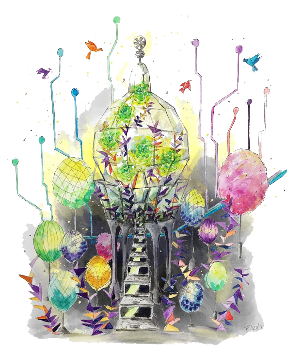

This is the Dipshit Central Digital Garden. 

A digital garden is a collection of evolving ideas that aren't strictly organized by their publication date. A digital garden is comparable to a human brain. Human brains are non-linear, so the digital garden isn't either. 

In the graph view, you'll find connections made between articles in the digital garden. Also, we recommend using dark mode. Happy gardening.